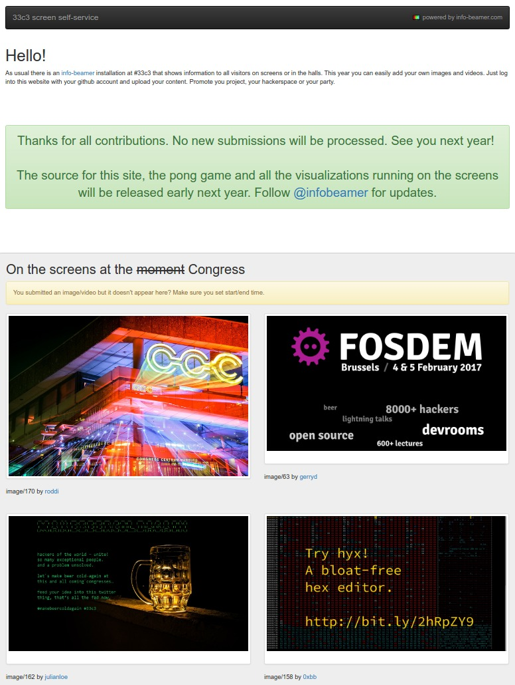

# The CMS running at 33c3.infobeamer.com during 33C3

I've set up a temporary site during
[33c3](https://events.ccc.de/congress/2016/wiki/Main_Page)
where visitors of the conference could easily upload images
and short videos.  Authentication was handled by using
github oauth logins.

Uploaded content was moderated by following links sent in a
moderation email for each upload.

[info-beamer hosted](https://info-beamer.com/hosted)
imported all content every 5 minutes and distributed the
assets to all devices.

All in all, 131 user generated images and videos were
uploaded during 33c3 and shown on various TV screens and in
the big halls.



## Installation

Tested on Ubuntu 16.04:

```
$ virtualenv --system-site-packages env
$ . env/bin/activate
$ pip install -r requirements.txt
```

The directory also serves as a daemontools runnable
directory. To start the website, link this directory to
/etc/service. After a few seconds the server should be up
and listen to port 10000.

During 33c3 the site itself was exposed through a locally
running nginx server. You can see the configuration used in
misc/33c3.conf. Additionally everything was running behind
cloudflare for trivial SSL setup.

For moderation mails I've used mailgun. Create a new SMTP
credential on the website and make sure to set it up in
`settings.cfg`.

Additionally the login uses github. I've set up a new
application for that. Grab the client id and secret key and
update `settings.cfg`.

Running the website will create an sqlite database
in `db/db` to save information about users and uploaded
assets.

## How it works

Users log into the site using their github account.  Upon
login it is verified that the account is allowed to use the
CMS by checking its age and follower count.

Logged in users can upload images and videos. After
uploading them, they are verified to have the correct size
and maximum play duration. Successful uploads are stored in
the `static/`.

## Integration with info-beamer hosted

In [hosted](https://info-beamer.com/hosted) you can import
the uploaded content as an info-beamer package. Just import
the package from (replace example.com with your domain):

```
https://example.com/export/infobeamer/package.links
```

Once done you can setup a cronjob somehwere that triggers
info-beamer hosted to poll for updates every 5 minutes like
this:

```
*/5  * * * * curl https://info-beamer.com/api/v1/package/XXXX/sync/YYYYYYYYYYYYYYYYYYYY
```

You can find the values for XXX and YYYY on the package page
in the webhook URL value.

The package integrates with the 
[33c3 info-beamer package](https://github.com/info-beamer/package-33c3)
. So you can add the imported package as a child package
to the 33c3 package. See the 33c3 package on how to configure
playback.

The source code for the CMS info-beamer code is in static.
Have a look at `tile.lua`.

## Potentially useful information

This project was an experiment and serves as a proof of
concept on how to build a simple custom content management
system that integrates into info-beamer hosted. As such I
used the opportunity to try new tools and approaches. In
particular the dashboard site of the CMS is a single page
app that is build with the ES6 javascript syntax using
vuejs. There might be better ways to implement things.
Running your own installation might work, but there's a lot
of rough edges.  If you have useful tips or want to
contribute, feel free to send me
[feedback](https://info-beamer.com/doc/about).


